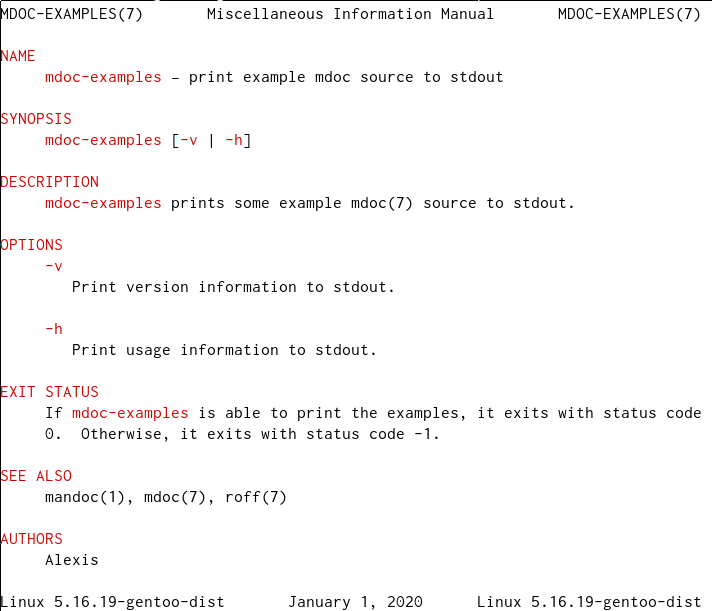

# Writing man pages with mdoc(7): a quickstart guide

## Introduction

Man pages are often authored using the presentation-oriented man(7) macros. However, man pages can also be authored with the semantics-oriented mdoc(7) macros. Man pages in the mdoc(7) format can be directly viewed on any OS which uses either the `man-db` system or the `mandoc` system; for a list of OSes which can view mdoc(7) man pages "out of the box", refer to [Appendix A](#appendix-a-os-mdoc-support).

## Background

Even if one's software for \*n\*x-ish systems has a comprehensive manual in another format, it should also have at least a brief man page providing information about running the program: how it can be called from the command line (including any available options), which environment variables it uses and affects (if any), the files it uses (e.g. for configuration), its possible exit statuses, what standards it conforms to (if any), and related programs.

On Linux, the standard language used to write man pages is [man(7)](https://man.openbsd.org/man.7). man(7) is a set of roff macros; roff is a typesetting language ultimately descended from [RUNOFF](https://en.wikipedia.org/wiki/RUNOFF), the first computer typesetting system, developed for [the CTSS project](https://en.wikipedia.org/wiki/Compatible_Time-Sharing_System) in 1963. Refer to [Appendix B](#appendix-b-a-brief-history-of-roff) for a brief historical timeline.

Unfortunately, the man(7) macros are presentation-oriented, rather than semantics-oriented. This limits the usefulness of the man page system, as the 'markup' provided by these macros do not indicate the nature of what's being marked up. For example, the italicisation of text might indicate one of any number of things: that the text is a placeholder for an argument to a command or function, that the text is a program, that the text is in a natural language different from the rest of the text, or merely that the text is being emphasised to the reader. Further, there is not necessarily any consistency in these usages from one set of documentation to the next.

Fortunately, the man(7) macros are not the only possibility: one can also write man pages with the [mdoc(7)](https://man.openbsd.org/mdoc.7) macros. The mdoc(7) macros *are* semantically oriented, so that, for example, if one wishes to search for all man pages referencing the `PATH` environment variable, one can do:

```
$ apropos Ev=PATH
```

where `Ev` is the macro used to indicate text that's an environment variable.

Additionally, the fact that the mdoc(7) is semantically-oriented greatly facilitates accurate conversion to other formats, such as HTML, Markdown or PDF.

Just as in Web design, mdoc(7) separates content from presentation.

### Why not use Markdown?

Markdown is a *bad* choice for producing quality man pages. It's presentation markup, not semantic markup, without even the possibility of the document author systematically adding semantics (unlike, for example, HTML, where one can add semantics via the `class` attribute). It has many flavours, each slightly different from the others: for example, the pandoc(1) man page lists "commonmark", "commonmark_x", "markdown", "markdown_mdd", "markdown_phpextra" and "markdown_strict" as distinct formats. And although the CommonMark spec exists, to a certain extent it suffers from the "[now you have 15 competing standards](https://xkcd.com/927/)" problem. It's certainly relatively easy to *write*, but it's much less easy to *parse*, hindering format conversion.

Even if you refuse to write mdoc(7) when authoring man pages, *please* try to use a source language that substantially facilitates semantic markup (e.g. HTML).

## roff implementations

[groff(1)](https://man.voidlinux.org/groff.1), GNU roff, is the current de facto standard roff program. However, another roff implementation is provided by [mandoc(1)](https://man.openbsd.org/mandoc.1). Both groff(1) and mandoc(1) support the mdoc(7) macro package in addition to man(7).

## roff: the basics

roff is a line-oriented language. Each line is either a control line, or a text line. Control lines have commands, such as a request or macro; text lines are plain text, with no requests/macros, but possibly some escape codes (cf. below). A control line usually has an initial `.`, followed by a request / macro. Lines that need to begin with a literal `.` are preceded a zero-width space, `\&`: `\&.`. Escape codes, which begin with a leading backslash (`\`), can be used to produce particular glyphs, such as an em dash (`\(em` -> `—`), a check mark (`\(OK` -> `✓`) or an accented character (`\(:y` -> `ÿ`); further details can be found in mandoc_char(7) or groff_char(7). Note that a literal backslash is produced by `\e`, not `\\`.

When writing man pages in mdoc(7), the mdoc(7) macros should be used as much as possible; using roff requests should only be a last resort.

## An artificial worked example

Firstly, the standard preamble:

```
.Dd January 1, 2020
.Dt MDOC-EXAMPLES 7
.Os
```

The `Dd` macro is for the Document Date, i.e. the date the source was last edited. Use American-style date format: in [strftime(3)](https://man.openbsd.org/strftime.3) terms, the format is `%B%e, %Y`.

The `Dt` macro is for the Document Title, i.e. the name of the software being documented, and its manual section.

The `Os` macro produces the name of the Operating System the man page is being accessed on.

The preceding will produce a header like:

```
MDOC-EXAMPLES(7)    General Commands Manual    MDOC-EXAMPLES(7)
```

together with a footer like:

```
[OS details]    January 1, 2020    [OS details]
```

where `[OS details]` is a placeholder for the actual OS details that would be produced.

Next, the NAME section:

```
.Sh NAME
.Nm mdoc-examples
.Nd print example mdoc source to stdout
```

The `Sh` macro is for a Section Header. In this instance, it's passed the argument `NAME`, which should be capitalised.

The `Nm` macro is for both defining and producing the name of the software. In this instance, it's passed the argument `mdoc-example`, which defines what will be produced by `Nm` on its own - cf. below.

the `Nd` macro is for producing a short description of the software, as provided by its argument. The argument should not have any punctuation at the end.

The preceding will produce something like:

```
NAME
    mdoc-examples — print example mdoc source to stdout
```

Next, the SYNOPSIS section:

```
.Sh SYNOPSIS
.Nm
.Op Fl v | Fl h
```

The use of `Nm` without arguments will produce the name of the software as previously defined, i.e. "mdoc-example".

The `Op` macro is for producing text about an Optional argument, and the `Fl` macro indicates a Flag. This line demonstrates *parsed* and *callable* macros: the `Op` macro is parsed for further macros, which themselves must be callable. `Fl` is a callable macro, which takes as its argument the literal for the flag.

The preceding will produce something like:

```
SYNOPSIS
    mdoc-example [-v | -h]
```

Next, the DESCRIPTION section:

```
.Sh DESCRIPTION
.Nm
prints some example
.Xr mdoc 7
source to stdout.
```

The `Xr` macro is for Cross References to other man pages. It takes two arguments: the name of the man page, and its section.

Note that any formatting command is on a distinct line of its own, rather than being inline.

The preceding will produce something like:

```
DESCRIPTION
    mdoc-examples prints some example mdoc(7) source to stdout.
```

Next, the OPTIONS section:

```
.Sh OPTIONS
.Bl -tag -width x
.It Fl v
Print version information to stdout.
.It Fl h
Print usage information to stdout.
.El
```

This section documents the options mentioned in the SYNOPSIS section.

The `Bl` macro Begins a List; the `El` macro Ends the List. The `-tag` argument specifies that item bodies should be indented by the value of the `-width` argument.

The `It` macro is a list ITem. It is parsed, so we use the `Fl` macro as its argument, with a literal as the argument to the `Fl` macro.

The preceding will produce something like:

```
OPTIONS
    -v
        Print version information to stdout.
    -h
        Print usage information to stdout.
```

Next, the EXIT STATUS section:

```
.Sh EXIT STATUS
If
.Nm
is able to print the examples, it exits with status code 0.
Otherwise, it exits with status code -1.
```
Note that a new sentence starts on a new line. To start a new paragraph, use the `Pp` macro.

The preceding will produce something like:

```
EXIT STATUS
    If mdoc-examples is able to print the examples, it exits with status code
    0.  Otherwise, it exits with status code -1.
```

Next, the SEE ALSO section:

```
.Sh SEE ALSO
.Xr mandoc 1 ,
.Xr mdoc 7 ,
.Xr roff 7
```

Man pages referenced in this section should be in alphabetical order, and the list of man pages should be separated by commas (`,`). Note how the commas are a distinct final argument on the request lines; this allows the punctuation to be handled appropriately.

The preceding will produce something like:

```
SEE ALSO
    mandoc(1), mdoc(7), roff(7)
```

Finally, the AUTHORS section:

```
.Sh AUTHORS
.An Alexis
```

The `An` macro indicates an author, and is parsed for other macros, such as `Mt`, MailTo, an email address.

The preceding will produce something like:

```
AUTHORS
    Alexis
```

The complete [mdoc-examples.7 file](mdoc-examples.7) can be viewed directly with man(1) on any `mandoc`-based or `man-db`-based system, without any need for compilation:

```
$ man ./mdoc-examples.7
```

Here's a screencap of formatted output:

<br>

## Detailed documentation

The mdoc(7) man page contains a reference for the mdoc(7) macros (including which macros are parsed and/or callable), information about macro syntax, and a description of the standard sections of a man page and their order.

The man pages for other documentation varies depending on whether an OS is `mandoc`-based or `man-db`-based; refer to [Appendix A](#appendix-a-os-mdoc-support) for a list of the defaults for various OSes.

### mandoc

* reference for escape codes to produce special characters: [mandoc_char(7)](https://man.openbsd.org/mandoc_char.7)
* reference for roff requests and syntax: [mandoc_roff(7)](https://man.voidlinux.org/roff.7) / [roff(7)](https://man.openbsd.org/roff.7) (OpenBSD)

### man-db

* reference for escape codes to produce special characters: [groff_char(7)](https://man.voidlinux.org/groff_char.7)
* reference for roff requests and syntax: [groff(7)](https://man.voidlinux.org/groff.7)

## Linting

Systems with mandoc(1) installed - regardless of whether it's being used as the man system - can use it to check mdoc(7) files for issues:

```
$ mandoc -T lint mdoc-examples.7
```

Refer to the DIAGNOSTICS section of the mandoc(1) man page for a detailed listing of errors, warnings and style issues.

## Output formats

mdoc(7) man pages can be converted to other formats via the `-T` option of mandoc(1) and groff(1). Available output formats include `ascii`, `html`, `pdf` and `utf8`; `markdown` is available with mandoc(1) but not groff(1).

## Real-world examples

Some real-world examples of mdoc(7) sources can be found in the following repositories:

* [execline-man-pages](https://github.com/flexibeast/execline-man-pages)
* [s6-man-pages](https://github.com/flexibeast/s6-man-pages)
* [s6-networking-man-pages](https://github.com/flexibeast/s6-networking-man-pages)
* [s6-portable-utils-man-pages](https://github.com/flexibeast/s6-portable-utils-man-pages)

## Reference

### Man pages

* [mdoc(7)](https://man.openbsd.org/mdoc.7)

* [mandoc_char(7)](https://man.openbsd.org/mandoc_char.7)
* [mandoc_roff(7)](https://man.voidlinux.org/roff.7) / [roff(7)](https://man.openbsd.org/roff.7) (OpenBSD)
* [mandoc(1)](https://man.openbsd.org/mandoc.1)

* [groff_char(7)](https://man.voidlinux.org/groff_char.7)
* [groff(7)](https://man.voidlinux.org/groff.7)
* [groff(1)](https://man.voidlinux.org/groff.1)

### General

* [The mandoc site](https://mandoc.bsd.lv/)

## Appendix A: OS mdoc support

OSes with a check mark ('✓') can display mdoc(7) man pages "out of the box", without any special configuration required on the part of the user.

```
+--------------+---+ --------------+
| OS           |   | man system    |
+--------------+---+---------------+
| Alpine       | ✓ | mandoc        |
| Arch         | ✓ | man-db        |
| Debian       | ✓ | man-db        |
| Fedora       | ✓ | man-db        |
| Gentoo       | ✓ | man-db        |
| OpenBSD      | ✓ | mandoc        |
| Ubuntu       | ✓ | man-db        |
| Void         | ✓ | mandoc        |
+--------------+---+---------------+
```

Corrections and/or additions to this table welcome and encouraged.

## Appendix B: a brief history of roff

```
+----------+---------+------------+---------+--------------------------+
| Date     | System  |  Language  |   OS    | Author(s)                |
+----------+---------+------------+---------+--------------------------+
| 1963     | RUNOFF  | MAD        | CTSS    | Jerry Saltzer            |
| 1969     | runoff  | BCPL       | Multics | Bob Morris, Doug McIlroy |
| 1973     | roff    | PDP-11 asm | Unix    | Joseph Ossanna           |
| 1975     | roff    | C          | Unix    | Brian Kernighan          |
| 1979     | ditroff | C          | Unix    | Brian Kernighan          |
| 1990     | groff   | C++        | Unix    | James Clark              |
+----------+---------+------------+---------+--------------------------+
``` 
Corrections to this table welcome and encouraged. Further historical details can be found [here](https://man.voidlinux.org/roff.7).
